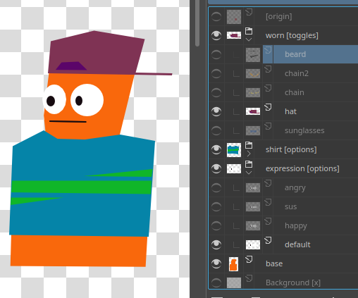
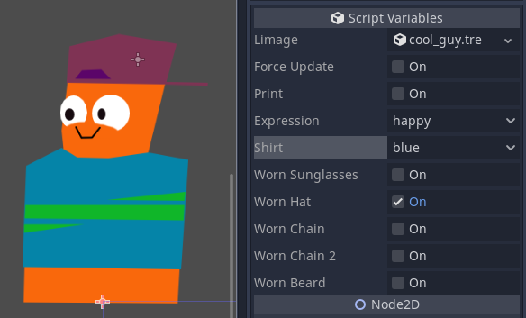
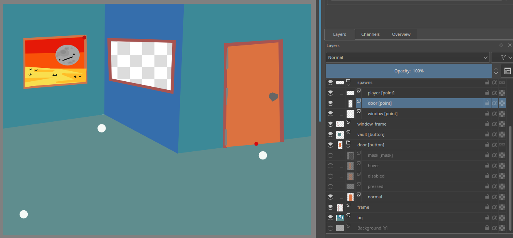
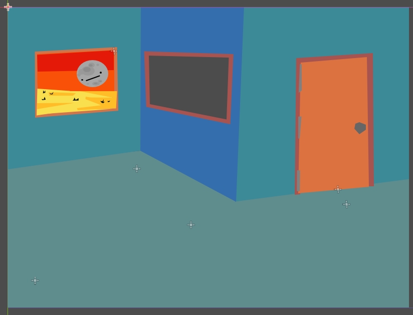
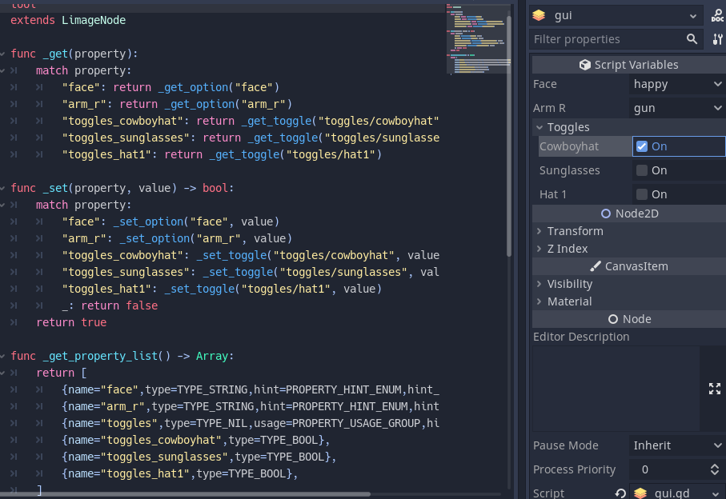
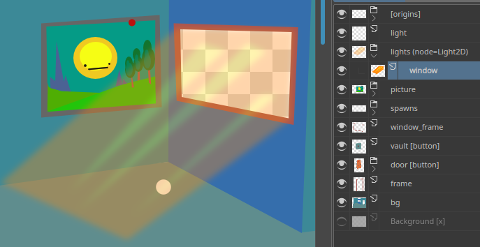
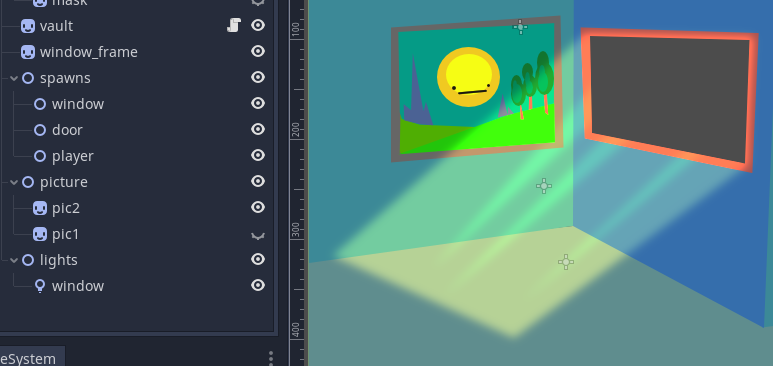
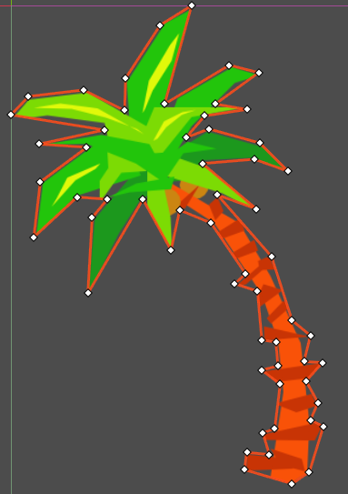

<center>

# Limage

   

Turn `.kra` `.psd` `.ora` images into *Godot* scenes `.tscn`.
</center>

Use your fav art tool. | What you see is what you'll get!
:-:|:-:
 | 

Add origins + spawn points | to make life easier.
:-:|:-:
 | 

Limage auto generates convenient code.



Tell Godot what kind of node | you want the layer to be.
:-:|:-:
 | 

# Features
**Disclaimer:** Requires Python to be installed. Not all features work the same across all file formats, but I'm working on that.

- Supports generating as `png` `webp` `jpeg` with tweakable settings for each.
- Scale options to shrink (or grow) all textures before importing.
- Optional [quantize](https://pillow.readthedocs.io/en/stable/reference/Image.html#PIL.Image.Image.quantize) to potentially shrink file size.
- [Origin](#Tags)s to make rotations easier.
- Main textures stored in the file, so it's all one asset.
- Secondary texture scenes are created for runtime load/unload.

# Getting Started
Requires python. In future I hope to reduce some of these steps.

- Download and install `limage` from [here](https://github.com/teebarjunk/limage).
- Drag `.kra` `.psd` `.ora` into Godot project.
- Select `import` in import tab.
- A scene will be generated next to the file.
- If any layers have the `options` or `toggles` tag, folders will be created with subscenes, that should stay next to the main scene.

# Node tags
Use `[]` for tags: `my layer [tag1 tag2]`\
Use `()` to apply tags to all children: `my group [tag] (childtag1 childtag2)`\
Use `(())` to apply tags to all descendants: `origins ((point))`

Tag|Description
:-:|--
`x`| Ignore layer. No texture or data generated.
`origin`| Defines origin of the parent group. If no parent, sets the global origin.
`node=?`| Hint for Godot to know what node to use, ie `[node=Light2D]`.
`group=?`| Add layer to Godot group. ie `[point group=Spawn]`
`point`| No texture. Center of image is converted to `Node2D` unless there is a `node` tag.
<!-- `copy`|(unfinished) Use texture of another layer. (Useful for limbs, eyes, repeating objects...)
`poly`|(unfinished)
`mask`|(unfinished) -->

## Group Layer Tags
Tag|Description
:-:|--
`options`|[[info]](#Options) Children will be options that can be toggled one at a time.
`toggles`|[[info]](#Options) Children will be toggleable.
`origins`|[[info]](#Origins) Children will be treated as points and used for layer origins, for easier rotations + scaling.
`points`|Children will all be turned into points, `Node2D`.
`merge`|"Flatten" child layers into one texture. (Not stable across formats.)

:o: = Tag for layer groups.\
Repository: [teebarjunk/limage](https://github.com/teebarjunk/limage)

# Options
When using `options` and `toggles`...

# Origins
todo

# Todo

- Better documentation.
- Points maintain layer order.
- Implement Krita clone layer/Photoshop smart layer.
- Finalize polygon generator.\*
- Auto normal map generation?
- [Sprite Dicing?](https://github.com/Elringus/SpriteDicing)
- Blend mode shaders?
- Vector layer support? (Looks doable for Krita.)

\* poly generation\



# Solutions

## WEBP

If WEBP exporting isn't working, try installing, reinstalling, or updating [PILLOW](https://pillow.readthedocs.io/en/stable/installation.html), and/or libwebp:

On Ubuntu:

```
sudo apt-get install -y libwebp-dev
```

## Credits
<div>Script icon made by <a href="https://www.flaticon.com/authors/itim2101" title="itim2101">itim2101</a> from <a href="https://www.flaticon.com/" title="Flaticon">www.flaticon.com</a></div>
