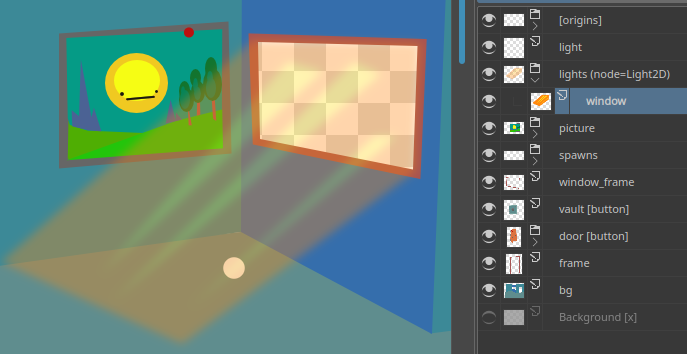
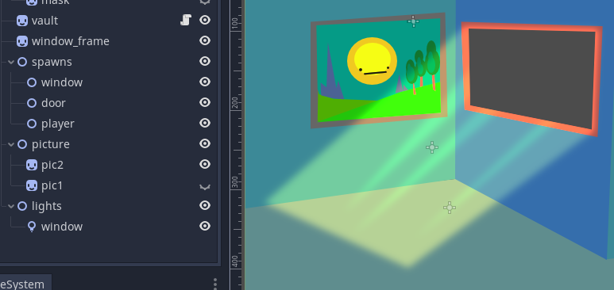

# limage v0.2.2

[Features](#Features)
[Getting Started](#Getting-Started)
[Tags](#Tags)
[Settings](#Settings)
[Todo](#Todo)
[Customizer](#Customizer)
[Changes](#Changes)
[Solutions](#Solutions)

**WARNING: Requires Python to be installed**

PSD (Photoshop, Krita, Gimp...) -> Godot.

Example files included. You can delete everything outside the "addons" folder.

Design in your prefered art tool. | How you lay it out is how you get it out!
:-:|:-:
 | 

Draw origins + spawn points | to make life easier.
:-:|:-:
 | 

Auto generate convenient code.


Tell Godot what kind of node | you want the layer to be.
:-:|:-:
 | 

Auto polygon scene generator (WIP)


## Features

- Convert PSD to images + layer info.
- Auto-generate scene where layer positions, visibility, and opacity are preserved in Godot.
- Add [origin](#Tags)s to make rotations easier.
- Many [image formats](https://pillow.readthedocs.io/en/stable/handbook/image-file-formats.html), like WEBP.
- Scale, [quantize](https://pillow.readthedocs.io/en/stable/reference/Image.html#PIL.Image.Image.quantize), and [optimize](#Settings) images.
- Images auto cropped to minimum size.
- Optionally merge layers at build time, so they can stay seperate in your psd.
- Only builds if there were changes.
- Helper scripts:
	- Button: Pixel perfect sprite clicking, without a mask. (Sprite can scale + rotate!).
	- Customizer: Script generator for [customizable content](#customizer).
	- Cursorize: Call *set_layer_as_cursor("layer_name")* to set any layer as the cursor. (Will use origin to offset).
- Polygon generator. (WIP! see [Tags](#Tags))


## Getting Started

- Install [python 3](https://www.python.org/downloads/)
- Install [psd_tools](https://psd-tools.readthedocs.io/en/latest/)

```
pip3 install psd-tools
```
- Create a *layered_images* folder in Godot. *res://layered_images*.
- Add .psd files. (Krita and Gimp can export .psd)
- Activate the plugin. (*Project > Project Settings > Plugins > Limage*)
- Click *Limage* at top of screen. (next to *2D, 3D, Script, Asset Lib*)
- Click *generate*.
- The textures will be placed in a *textures* folder, and the data in a *data* folder.


## Populating Scene

- Create a scene in Godot.
- Add *LimageNode.gd* script to it.
- Drag *data/name-of-your-psd* **.tres** into the *limage* field.
- Click the *force_update* toggle twice.

That should work. You could remove the LimageNode.gd if you like.

Every time you double click *force_update* it will update. Useful if you made changes. But it won't delete nodes. You can manually delete all the children to clear, and do a fresh generation.


## Tags

Add tags in layer names, between []: *layer_name [tag_1 tag2 tag-3]*

Use () to set tags for all children. *layer_group \[tag1\] (tag2 tag3)*

Use (()) to set tags for all descendants. *buttons ((button))*

Tags can have values: *background [parallax=10]* which you can then get in Godot with *limage.get_layer("background").tags.get("parallax")*.

- **x**: Completely ignore layer. (Wont export image or layer info.)
- **visible**: Will make layer visible, regardless of it's state in the psd.
- **!visible**: ^
- **point**: Won't generate an image, but will create an empty node in the scene. Useful for spawn points.
- **origin**: Sets the origin of the parent group. If no parent, sets the global origin.
- **poly**: (WIP!) Will generate a polygon scene. (Requires **opencv-python** and **numpy**)
- **button**: Makes a clickable sprite button.
- **node**: Tells Godot what node to use. *my_light [node=Light2D]*

These tags can be used on *group* layers.

- **origins**: Children will be treated as points and used for layer origins, for easier rotations + scaling.
- **merge**: "Flatten" children into one image.
- **options**: Treat children as options for a sprite. (good for customizable objects.)
- **toggles**: Treat children as optional child sprites that will be added/removed if enabled/disabled.


## Settings

Export settings can be tweaked by including a *json* file next to the psd, with an identical name.

So next to *layered_images/my_picture* **.psd** include *layered_images/my_picture* **.json** with your settings.

```python
# default settings
"path": "",						# location of psd if not in directory. (not implemented yet)
"seperator": "-",				# change to "/" and images will be stored in subfolders instead.

"texture_dir": None,			# if set, saves textures here
"data_dir": "data",				# if set, saves layer data here

# rescale textures
"scale": 1,

# in range of 0.0 - 1.0. makes rotation + flipping easier.
# creating a layer with an "origin" tag will replace this. 
"origin": [0, 0],

# you can choose any image format pillow + Godot support.
# but PNG, WEBP, and JPG are probably the most common.
# https://pillow.readthedocs.io/en/stable/handbook/image-file-formats.html
# https://docs.godotengine.org/en/stable/getting_started/workflow/assets/importing_images.html
"format": "WEBP", # WEBP can be A LOT smaller than png. and Godot supports it.

# can really decrease file size, but at cost of color range.
# https://pillow.readthedocs.io/en/stable/reference/Image.html#PIL.Image.Image.quantize
"quantize": False,

# default texture format settings
"PNG": {
	"optimize": True,
},

"WEBP": {
	"lossless": True,
	"method": 3,
	"quality": 80
},

"JPEG": {
	"optimize": True,
	"quality": 80
}
```

## Todo

- Better documentation.
- Finalize polygon generator.
- Normal map generation.
- Blend mode shaders.
- Optional padding for textures.
- Text placement + preservation. (I only work with krita, which doesn't preserve text info when converting to psd.)


## Customizer

If you include an *options* or *toggles* tag in any layer, a Godot script will be generated to make layer manipulation easier.

You can then replace *LimageNode.gd* with it.

You should override this rather than add code to it, as it will be replaced when regenerating.

## Changes

**0.2.2**

- Added *node* tag, so you can tell Godot what Node to use.
- LimageNode now properly uses local coordinates, so it can be a child, rotated, scaled, without problems.
- LimageNode *options* and *toggles* fields now work in editor more stabily.
- LimageNode *toggles* initial visibility is fixed.

**0.2.1**

- Editor should reload files properly now.

**0.2**

- Saving + loading should work better on Windows.
- Fixed *merge* tag still generating child textures.
- Fixed JPEG error because of no alpha channel.
- Fixed polygon generation not working with some image formats.
- If settings file is changed, image will be rebuilt.


## Solutions

### WEBP

If WEBP exporting isn't working, try installing, reinstalling, or updating [PILLOW](https://pillow.readthedocs.io/en/stable/installation.html), and/or libwebp:

On Ubuntu:

```
sudo apt-get install -y libwebp-dev
```
