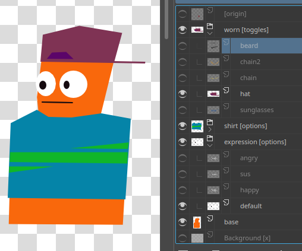
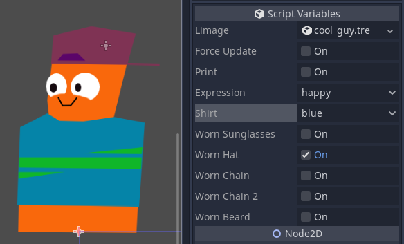
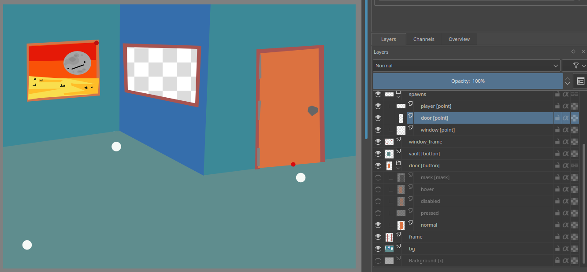
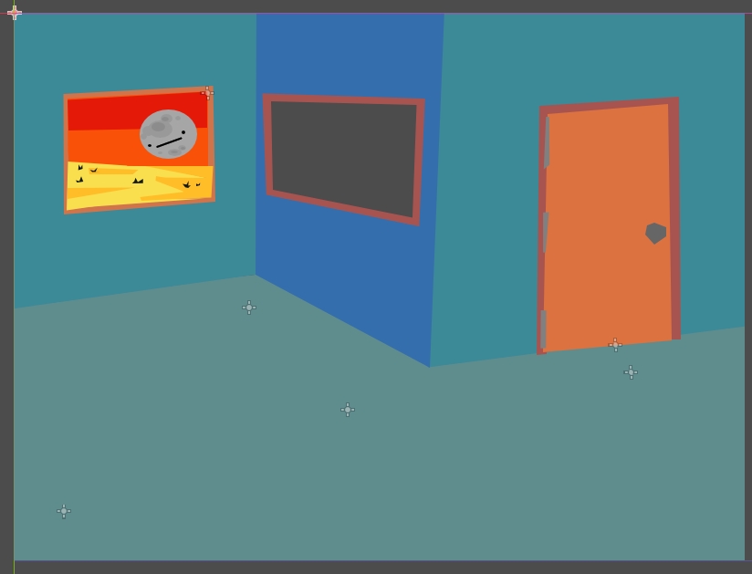
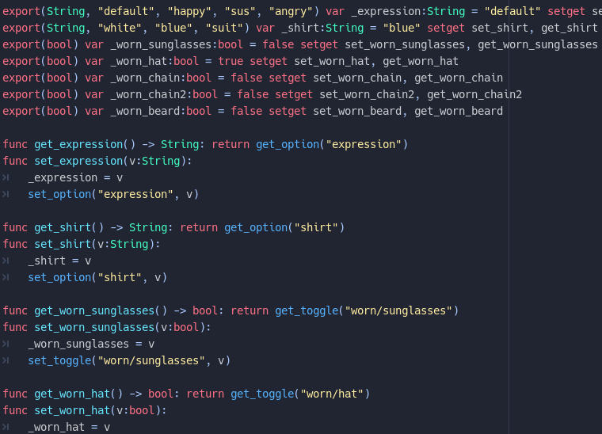
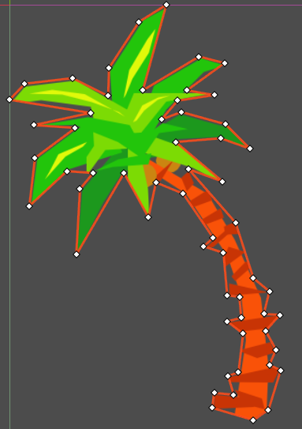

# limage v0.2.1

[features](#features)
[getting started](#getting-started)
[tags](#tags)
[settings](#settings)
[todo](#todo)
[customizer](#customizer)
[changes](#changes)
[solutions](#solutions)

**WARNING: requires python to be installed**

psd (photoshop, krita, gimp...) -> godot.

example included. you can delete everything outside the "addons" folder.

design in your prefered art tool | how you lay it out is how you get it out!
:-:|:-:
 | 

draw origins + spawn points | to make life easier
:-:|:-:
 | 

auto generate convenient code:



auto polygon scene generator (WIP)




## features

- convert psd to images + layer info.
- auto-generate scene where layer positions, visibility, and opacity are preserved in godot.
- add [origin](#tags)s to make rotations easier.
- many [image formats](https://pillow.readthedocs.io/en/stable/handbook/image-file-formats.html), like WEBP.
- scale, [quantize](https://pillow.readthedocs.io/en/stable/reference/Image.html#PIL.Image.Image.quantize), and [optimize](#settings) images.
- images auto cropped to minimum size.
- optionally merge layers at build time, so they can stay seperate in your psd.
- only builds if there were changes.
- helper scripts:
	- button: pixel perfect sprite clicking, without a mask. (sprite can scale + rotate!).
	- customizer: script generator for [customizable content](#customizer).
	- cursorize: call *set_layer_as_cursor("layer_name")* to set any layer as the cursor. (will use origin to offset).
- polygon generator (WIP! see [tags](#tags))


## getting started

- install [python 3](https://www.python.org/downloads/)
- install [psd_tools](https://psd-tools.readthedocs.io/en/latest/)

```
pip3 install psd-tools
```
- create a **layered_images** folder in godot. *"res://layered_images"*.
- add .psd files. (krita and gimp can export .psd)
- activate the plugin. (*Project > Project Settings > Plugins > Limage*)
- click **Limage** at top of screen. (next to *2D, 3D, Script, Asset Lib*)
- click **generate**.
- the textures will be placed in a *"textures"* folder, and the data in a *"data"* folder.


## populating scene

- create a scene in godot. (any node, but Node2D or Control are ideal.)
- add **LimageNode.gd** script to it.
- drag "*data/name-of-your-psd* **.tres**" into the "**limage**" field.
- click the "**force_update**" toggle twice.

that should work. you could remove the LimageNode.gd if you like.

every time you double click **force_update** it will update. useful if you made changes. but it won't delete nodes. you can manually delete all the children to clear, and do a fresh generation.


## tags

in your art program add tags between []: "*layer_name [tag_1 tag2 tag-3]*"

you can apply a tag to all child layers with (), and all descendants with (()). "*buttons (button)*"

tags can have values: "*background [parallax=10]*" which you can then use in godot with *limage.get_layer("background").tags.get("parallax")*.

- **x**: completely ignore layer. (wont export image or layer info)
- **visible**: will make layer visible, regardless of it's state in the psd.
- **!visible**: ^
- **point**: won't generate an image, but will create an empty node in the scene. useful for spawn points.
- **origin**: sets the origin of the parent group. if no parent, sets the global origin.
- **poly**: (WIP!) will generate a polygon scene. (requires **opencv-python** and **numpy**)
- **button**: makes a clickable sprite button.

these tags can be used on "group" layers.

- **origins**: children will be treated as points and used for layer origins, for easier rotations + scaling.
- **merge**: "flatten" children into one image.
- **options**: treat children as options for a sprite. (good for customizable objects.)
- **toggles**: treat children as optional child sprites that will be added/removed if enabled/disabled.


## settings

export settings can be tweaked by including a **json** file next to the psd, with an identical name.

so next to "*layered_images/my_picture* **.psd**" include "*layered_images/my_picture* **.json**" with your settings.

```python
# default settings
"path": "",						# location of psd if not in directory. (not implemented yet)
"seperator": "-",				# change to "/" and images will be stored in subfolders instead.

"texture_dir": None,			# if set, saves textures here
"data_dir": "data",				# if set, saves layer data here

# rescale textures
"scale": 1,

# in range of 0.0 - 1.0. makes rotation + flipping easier.
# creating a layer with an "origin" tag will replace this. 
"origin": [0, 0],

# you can choose any image format pillow + godot support.
# but PNG, WEBP, and JPG are probably the most common.
# https://pillow.readthedocs.io/en/stable/handbook/image-file-formats.html
# https://docs.godotengine.org/en/stable/getting_started/workflow/assets/importing_images.html
"format": "WEBP", # WEBP can be A LOT smaller than png. and godot supports it.

# can really decrease file size, but at cost of color range.
# https://pillow.readthedocs.io/en/stable/reference/Image.html#PIL.Image.Image.quantize
"quantize": False,

# default texture format settings
"PNG": {
	"optimize": True,
},

"WEBP": {
	"lossless": True,
	"method": 3,
	"quality": 80
},

"JPEG": {
	"optimize": True,
	"quality": 80
}
```

## todo
- better documentation.
- finalize polygon generator.
- normal map generation.
- blend mode shaders.
- optional padding for textures.
- text placement + preservation. (i only work with krita, which doesn't preserve text info when converting to psd.)
- upscaling with opencv + deep learning. https://towardsdatascience.com/deep-learning-based-super-resolution-with-opencv-4fd736678066


## customizer

if you include an **options** or **toggles** tag in any layer, a godot script will be generated to make layer manipulation easier.

you can then replace **LimageNode.gd** with it.

godot might complain when these scripts are first generated.

they work in editor, but they might display some wrong info in the panel.


## changes

**0.2.1**
- editor should reload files properly now.

**0.2**
- saving + loading should work better on Windows.
- fixed "merge" group tag still generating child textures.
- fixed JPEG error because of no alpha channel.
- fixed polygon generation not working with some image formats.
- if settings file is changed, image will be rebuilt.


## solutions

### webp

if webp exporting isn't working, try installing, reinstalling, or updating [PILLOW](https://pillow.readthedocs.io/en/stable/installation.html), and/or libwebp:

on ubuntu:

```
sudo apt-get install -y libwebp-dev
```
